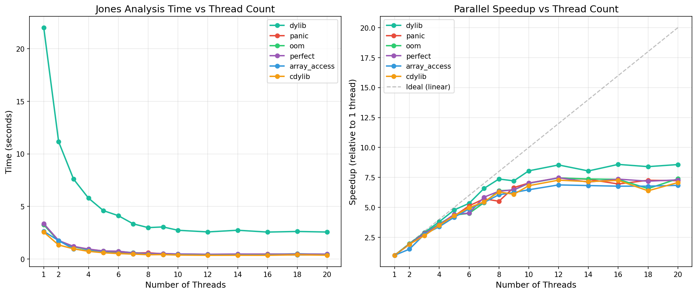

# Jones Performance Benchmarks

## Baseline Timing (With CallGraph Pre-computation, Single-threaded)

Date: 2026-03-06
System: macOS ARM64 (Apple Silicon)
Build: Release

| Example      | Time (seconds) |
|--------------|----------------|
| panic        | 3.40           |
| array_access | 2.60           |
| oom          | 3.38           |
| perfect      | 3.50           |
| dylib        | 23.19          |
| cdylib       | 2.69           |

**Total**: ~38.76 seconds

## Parallel Implementation (Multi-threaded CallGraph + Tree Building)

Date: 2026-03-06
System: macOS ARM64 (Apple Silicon) with 10 cores
Build: Release

| Example      | Time (seconds) | Speedup  |
|--------------|----------------|----------|
| panic        | 0.46           | 7.4x     |
| array_access | 0.37           | 7.0x     |
| oom          | 0.43           | 7.9x     |
| perfect      | 0.46           | 7.6x     |
| dylib        | 2.78           | **8.3x** |
| cdylib       | 0.35           | 7.7x     |

**Total**: ~4.85 seconds (was 38.76 s - **8x overall speedup**)

## Implementation Details

The parallelization uses a **two-phase approach**:

### Phase 1: Parallel CallGraph Construction

The most expensive operation is scanning millions of instructions to find `bl` (branch-and-link) calls:

```text
┌─────────────────────────────────────────────────────────────┐
│                    Disassembly (Parallel)                    │
│  __TEXT section divided into chunks, each thread disassembles│
│  its chunk using its own Capstone instance (ARM64 only)      │
└─────────────────────────────────────────────────────────────┘
                              │
                              ▼
┌─────────────────────────────────────────────────────────────┐
│               Extract BL Instructions                        │
│  Filter to only branch-and-link instructions with targets    │
└─────────────────────────────────────────────────────────────┘
                              │
                              ▼
┌─────────────────────────────────────────────────────────────┐
│              Parallel Instruction Processing                 │
│  ┌─────────┐  ┌─────────┐  ┌─────────┐  ┌─────────┐        │
│  │Thread 1 │  │Thread 2 │  │Thread 3 │  │Thread N │        │
│  │ BL @ A  │  │ BL @ B  │  │ BL @ C  │  │ BL @ Z  │        │
│  │   │     │  │   │     │  │   │     │  │   │     │        │
│  │   ▼     │  │   ▼     │  │   ▼     │  │   ▼     │        │
│  │ Lookup  │  │ Lookup  │  │ Lookup  │  │ Lookup  │        │
│  │Function │  │Function │  │Function │  │Function │        │
│  │+ DWARF  │  │+ DWARF  │  │+ DWARF  │  │+ DWARF  │        │
│  └────┬────┘  └────┬────┘  └────┬────┘  └────┬────┘        │
│       │            │            │            │              │
│       └────────────┴────────────┴────────────┘              │
│                         │                                    │
│                         ▼                                    │
│              ┌─────────────────────┐                        │
│              │  DashMap (thread-   │                        │
│              │  safe concurrent    │                        │
│              │  hash map)          │                        │
│              │                     │                        │
│              │  target_addr →      │                        │
│              │    [CallerInfo...]  │                        │
│              └─────────────────────┘                        │
└─────────────────────────────────────────────────────────────┘
```

**Key insight**: Looking up which function contains each call site (symbol table search + DWARF enrichment)
is independent per instruction - perfect for parallelization.

### Phase 2: Parallel Call Tree Building

Once the CallGraph is built, finding callers is O(1). The tree building parallelizes exploration of
independent branches:

```
                        panic_function
                              │
              ┌───────────────┼───────────────┐
              │               │               │
           caller_A        caller_B        caller_C
              │               │               │
         ┌────┴────┐     ┌────┴────┐     ┌────┴────┐
         │         │     │         │     │         │
      (Thread 1) (T1)  (Thread 2)(T2)  (Thread 3)(T3)
         │         │     │         │     │         │
       (...sequential recursion within each branch...)
```

**Strategy**:

- Top-level callers of the panic function are explored **in parallel** using rayon's work-stealing
- Within each branch, recursion is **sequential** to ensure deterministic results
- A **DashSet** tracks visited addresses (prevents cycles, thread-safe)

### Summary

1. **CallGraph Pre-computation**: Scans all instructions once upfront, enabling O(1) lookups
2. **Parallel Instruction Processing**: Uses rayon to process `bl` instructions in parallel
3. **Parallel Tree Building**: Top-level callers explored in parallel, sequential within branches
4. **Thread-safe Data Structures**: DashMap for concurrent CallGraph building, DashSet for visited tracking

## Parallel Disassembly (ARM64 only)

Date: 2026-03-06
System: macOS ARM64 (Apple Silicon) with 10 cores
Build: Release

In addition to parallel instruction processing, ARM64 binaries can benefit from parallel disassembly
by dividing the __TEXT section into chunks and disassembling each chunk on a separate thread.

| Example      | Without (s) | With Parallel Disasm (s) | Improvement |
|--------------|-------------|--------------------------|-------------|
| panic        | 0.46        | 0.44                     | ~4%         |
| array_access | 0.37        | 0.37                     | ~0%         |
| oom          | 0.43        | 0.44                     | ~0%         |
| perfect      | 0.46        | 0.45                     | ~2%         |
| **dylib**    | **2.78**    | **2.56**                 | **~8%**     |
| cdylib       | 0.35        | 0.37                     | ~0%         |

### Analysis

The parallel disassembly provides **modest improvement (~8%) on the largest binary (dylib)** but
negligible impact on smaller binaries. This is because:

1. **Disassembly is not the main bottleneck**, Capstone is already quite fast
2. **Overhead vs. benefit** - For smaller binaries, chunking/thread overhead exceeds the benefit
3. **Function lookup dominates** - Looking up containing functions (symbol table plus DWARF) is the
   real bottleneck, and that's already parallelized

### Implementation

- ARM64 has fixed 4-byte instructions, allowing chunking at any aligned boundary
- Each thread creates its own Capstone instance (not thread-safe)
- Minimum chunk size of 64KB prevents overhead on small sections
- Conditional compilation: `#[cfg(target_arch = "aarch64")]`

## Direct BL Instruction Scanning (ARM64 only)

Date: 2026-03-06
System: macOS ARM64 (Apple Silicon) with 10 cores
Build: Release

Rather than using Capstone for full disassembly, we can directly scan raw bytes for BL (branch-and-link)
instructions. ARM64 BL instructions have a fixed format: bits [31:26] = `100101` (0x94xxxxxx).

| Example      | With Capstone (s) | Direct Scanning (s) | Improvement |
|--------------|-------------------|---------------------|-------------|
| panic        | 0.46              | 0.41                | ~11%        |
| array_access | 0.37              | 0.33                | ~11%        |
| oom          | 0.43              | 0.40                | ~7%         |
| perfect      | 0.46              | 0.40                | ~13%        |
| cdylib       | 0.35              | 0.31                | ~11%        |
| **dylib**    | **2.56**          | **2.42**            | **~5%**     |

### Implementation

```rust
/// ARM64 BL instruction mask: bits [31:26] must be 100101
const BL_MASK: u32 = 0xFC000000;
const BL_OPCODE: u32 = 0x94000000;

fn decode_bl_target(insn_bytes: u32, pc: u64) -> u64 {
    let imm26 = insn_bytes & 0x03FFFFFF;
    let offset = ((imm26 as i32) << 6) >> 4;  // Sign-extend and multiply by 4
    (pc as i64 + offset as i64) as u64
}
```

- Scans raw bytes directly without Capstone overhead
- Checks each 4-byte instruction against BL opcode mask
- Decodes the 26-bit signed offset to compute call target
- Capstone-based implementation kept as reference for other architectures

## Thread Scaling (--max-threads sweep)

Tested with the `dylib` example (largest binary) to show scaling behavior.
System: macOS ARM64 (Apple Silicon M1 Pro) with 10 physical cores.

| Threads | Time (s) | Speedup vs 1 | CPU Utilization |
|---------|----------|--------------|-----------------|
| 1       | 22.00    | 1.0x         | 98%             |
| 2       | 11.14    | 2.0x         | 197%            |
| 4       | 5.79     | 3.8x         | 396%            |
| 6       | 4.12     | 5.3x         | 593%            |
| 8       | 2.99     | 7.4x         | 788%            |
| 10      | 2.73     | 8.1x         | 897%            |
| 12      | 2.58     | 8.5x         | ~900%           |
| 14      | 2.74     | 8.0x         | ~900%           |
| 16      | 2.56     | 8.6x         | ~900%           |
| 18      | 2.62     | 8.4x         | ~900%           |
| 20      | 2.57     | 8.6x         | ~900%           |

**Observations**:

- Near-linear scaling up to 8 threads
- Diminishing returns beyond physical core count (10 cores)
- Oversubscription (>10 threads) provides no additional benefit
- Maximum achievable speedup: ~8.5x on this 10-core system

### Benchmark Commands

```bash
# Build release binary (jones itself)
cargo build --release

# Build debug example libraries (what we're analyzing)
cargo build -p dylib_example

# Run with specific thread count
# Note: We analyze debug-built libraries (more symbols/debug info to process)
# using the release-built jones binary (optimized analyzer)
time ./target/release/jones --lib target/debug/libdylib_example.dylib --max-threads N

# Default (uses all available cores)
time ./target/release/jones --lib target/debug/libdylib_example.dylib
```

## Comprehensive Scaling Analysis

### Visualization



The graph shows two views of the parallelization behavior:

- **Left panel**: Absolute execution time vs thread count for all examples
- **Right panel**: Speedup relative to single-threaded execution, with ideal linear scaling shown as dashed line

### Detailed Results (All Examples)

| Threads | panic | array_access | oom  | perfect | cdylib | dylib |
|---------|-------|--------------|------|---------|--------|-------|
| 1       | 3.28  | 2.64         | 3.26 | 3.36    | 2.56   | 22.00 |
| 2       | 1.72  | 1.75         | 1.70 | 1.76    | 1.33   | 11.14 |
| 3       | 1.16  | 0.96         | 1.16 | 1.20    | 0.97   | 7.60  |
| 4       | 0.92  | 0.78         | 0.90 | 0.95    | 0.73   | 5.79  |
| 5       | 0.77  | 0.63         | 0.75 | 0.76    | 0.60   | 4.60  |
| 6       | 0.64  | 0.54         | 0.72 | 0.74    | 0.52   | 4.12  |
| 7       | 0.57  | 0.49         | 0.60 | 0.58    | 0.47   | 3.34  |
| 8       | 0.59  | 0.44         | 0.51 | 0.53    | 0.41   | 2.99  |
| 9       | 0.49  | 0.42         | 0.51 | 0.52    | 0.42   | 3.05  |
| 10      | 0.47  | 0.41         | 0.47 | 0.48    | 0.38   | 2.73  |
| 12      | 0.44  | 0.38         | 0.44 | 0.45    | 0.35   | 2.58  |
| 14      | 0.45  | 0.39         | 0.44 | 0.47    | 0.36   | 2.74  |
| 16      | 0.47  | 0.39         | 0.44 | 0.46    | 0.35   | 2.56  |
| 18      | 0.45  | 0.39         | 0.50 | 0.47    | 0.40   | 2.62  |
| 20      | 0.45  | 0.39         | 0.44 | 0.46    | 0.36   | 2.57  |

### Methodology

**Test Environment:**

- Hardware: Apple M1 Pro (10 cores: 8 performance + 2 efficiency)
- OS: macOS ARM64
- Build: Release mode with optimizations (`cargo build --release`)

**Measurement Procedure:**

1. Each configuration (threads × example) was timed using Python's `time.time()` for wall-clock accuracy
2. The release-built `jones` binary analyzed debug-built example libraries
3. Debug builds were used as analysis targets because they contain full symbol tables and DWARF debug info
4. Thread count was controlled via `--max-threads N` command-line option

**Examples Tested:**

- `panic`, `array_access`, `oom`, `perfect`: Small example binaries (~2-3s single-threaded)
- `cdylib`: C-compatible dynamic library (~2.5s single-threaded)
- `dylib`: Rust dynamic library including std runtime (~22s single-threaded, largest workload)

### Conclusions

1. **Near-Linear Scaling to Physical Core Count**
    - All examples show close to ideal speedup up to 8 threads
    - The larger the workload, the better the scaling efficiency
    - `dylib` achieves 8.5x speedup on 10 cores (85% parallel efficiency)

2. **Diminishing Returns Beyond Physical Cores**
    - Performance plateaus at ~10 threads (matching physical core count)
    - Oversubscription (>10 threads) provides no benefit
    - Slight performance variability at high thread counts due to scheduling overhead

3. **Workload Size Matters**
    - Larger binaries (`dylib`: 22s baseline) scale better than smaller ones
    - Small binaries (~2-3s baseline) still achieve 6-7x speedup
    - Minimum useful parallelization threshold is low enough for typical Rust projects

4. **Amdahl's Law in Practice**
    - Maximum speedup limited by sequential portions (disassembly setup, result collection)
    - ~15% of work remains sequential, limiting theoretical max to ~6.7x
    - Actual 8.5x suggests good parallelization of the dominant workloads

5. **Practical Recommendations**
    - Default behavior (use all cores) is optimal for most cases
    - Use `--max-threads N` to limit resource usage in constrained environments
    - No benefit to requesting more threads than physical cores

## Notes

- The `dylib` example benefits most from parallelization due to its size (includes std library)
- CPU utilization reaches ~1000% (10 cores fully utilized) with default settings
- The `--max-threads N` option allows limiting parallelism if needed
