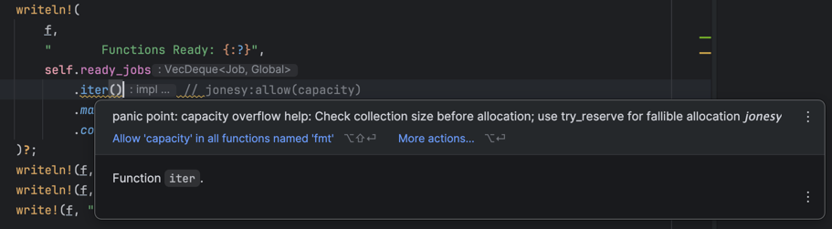

# Jonesy

Jonesy is a static analysis tool that finds code paths in Rust binaries that can lead to panics at runtime.

## Quick Start

```bash
# Install
cargo install jonesy

# Analyze a Rust project
cd your-rust-project
cargo build
jonesy
```

For [IDE integration](/lsp), run `jonesy lsp` to get inline diagnostics and quick fixes:



## Features

- Analyzes compiled Rust binaries using DWARF debug info
- Detects 20+ types of panic-inducing code patterns
- Provides actionable suggestions for each panic type
- Supports binaries, libraries (rlib, cdylib, dylib), and workspaces
- LSP server for IDE integration

## Panic Reference

Jonesy detects and classifies panics with unique error codes. Click on any code below for detailed documentation including examples and how to avoid the panic.

| Code | Cause | Description |
|------|-------|-------------|
| [JP001](/panics/JP001-explicit-panic) | Explicit Panic | Direct `panic!()` macro call |
| [JP002](/panics/JP002-bounds-check) | Bounds Check | Index out of bounds |
| [JP003](/panics/JP003-arithmetic-overflow) | Arithmetic Overflow | Integer overflow in arithmetic |
| [JP004](/panics/JP004-shift-overflow) | Shift Overflow | Bit shift by too many positions |
| [JP005](/panics/JP005-division-by-zero) | Division by Zero | Division or remainder by zero |
| [JP006](/panics/JP006-unwrap-none) | Unwrap None | `unwrap()` on `Option::None` |
| [JP007](/panics/JP007-unwrap-err) | Unwrap Err | `unwrap()` on `Result::Err` |
| [JP008](/panics/JP008-expect-none) | Expect None | `expect()` on `Option::None` |
| [JP009](/panics/JP009-expect-err) | Expect Err | `expect()` on `Result::Err` |
| [JP010](/panics/JP010-assert-failed) | Assert Failed | `assert!()` condition false |
| [JP011](/panics/JP011-debug-assert-failed) | Debug Assert Failed | `debug_assert!()` condition false |
| [JP012](/panics/JP012-unreachable) | Unreachable | `unreachable!()` macro reached |
| [JP013](/panics/JP013-unimplemented) | Unimplemented | `unimplemented!()` macro reached |
| [JP014](/panics/JP014-todo) | Todo | `todo!()` macro reached |
| [JP015](/panics/JP015-panic-in-drop) | Panic in Drop | Panic during destructor |
| [JP016](/panics/JP016-cannot-unwind) | Cannot Unwind | Panic in no-unwind context |
| [JP017](/panics/JP017-formatting-error) | Formatting Error | Error in `format!()` or `Display` |
| [JP018](/panics/JP018-capacity-overflow) | Capacity Overflow | Collection capacity exceeded |
| [JP019](/panics/JP019-out-of-memory) | Out of Memory | Memory allocation failed |
| [JP020](/panics/JP020-string-slice-error) | String/Slice Error | Invalid string or slice operation |
| [JP021](/panics/JP021-invalid-enum) | Invalid Enum | Invalid enum discriminant |
| [JP022](/panics/JP022-misaligned-pointer) | Misaligned Pointer | Pointer alignment violation |

## Resources

- [GitHub Repository](https://github.com/andrewdavidmackenzie/jonesy)
- [Installation Guide](https://github.com/andrewdavidmackenzie/jonesy#installation)
- [Command Line Options](https://github.com/andrewdavidmackenzie/jonesy#command-line-options)
- [IDE Integration (LSP)](/lsp)
